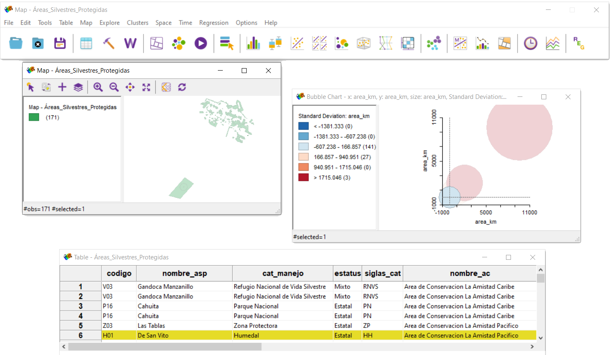
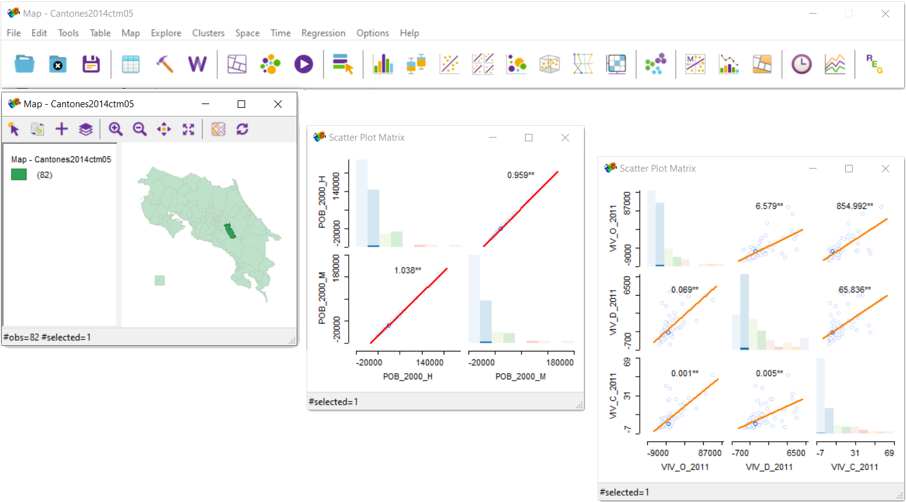
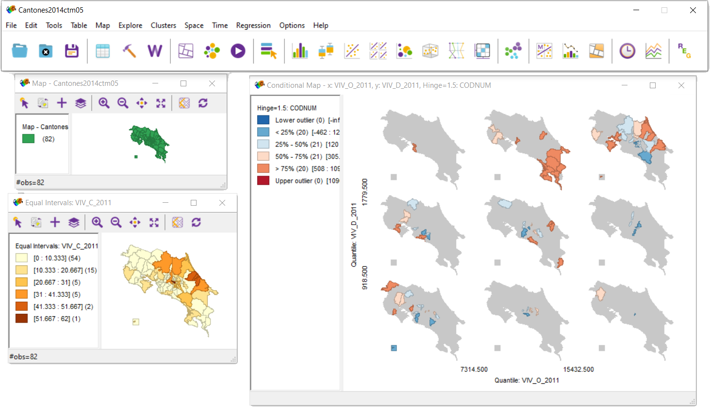

# GeoDA
*Software gratuito y de código abierto que sirve como introducción a la ciencia de datos espaciales*

### *Objetivo del GeoDA*

*Ayudar a los investigadores y analistas a enfrentar el desafío de convertir datos en valor. Este desafío implica traducir datos en conocimientos*

## Historia
>GeoDa reemplazó lo que anteriormente se llamaba *DynESDA*, un módulo que funcionaba bajo el antiguo *ArcView 3.x* para realizar análisis exploratorios de datos espaciales (o ESDA ). Las versiones actuales de GeoDa ya no dependen de la presencia de *ArcView* u otros paquetes SIG en un sistema.

Anselin, L., Li, X., & Koschinsky, J. (2021)

Su desarrollo fue por el [**equipo**](https://spatial.uchicago.edu/directories/full/team) del Dr. Luc Anselin de la [**Universidad de Chicago**](https://www.uchicago.edu/). El programa proporciona:

1.  Interfaz gráfica de fácil uso
2.  Métodos de análisis exploratorio de datos espaciales (ESDA)
3.  Estadísticas de autocorrelación espacial
4.  Análisis de regresión espacial básica   

Desde su lanzamiento inicial en febrero de 2003, el número de usuarios de GeoDa ha aumentado exponencialmente a más de 520.000 (junio de 2022). Esto incluye los usuarios de laboratorios de las universidades como:
-    [Harvard](https://www.harvard.edu/)
-    [Instituto Tecnológico de Massachusetts (MIT)](https://www.mit.edu/)
-    [Cornell](https://www.cornell.edu/)

Es un software multiplataforma ([**Windows**](http://geodacenter.github.io/download_windows.html), [**Mac OSx**](http://geodacenter.github.io/download_mac.html),[**Linux**](http://geodacenter.github.io/download_linux.html)) que permite el uso de diversos tipos de archivos que almacenan información espacial.

GeoDa tiene poderosas capacidades para realizar análisis espaciales, análisis de datos exploratorios multivariados y autocorrelación espacial global y local . También realiza regresión lineal básica . En cuanto a los modelos espaciales, se incluyen tanto el modelo de rezago espacial como el modelo de error espacial , ambos estimados por máxima verosimilitud .

## Formatos de datos espaciales permitidos 

| Formato del archivo | Extensión |
| :--- | :---: |
| Comma Separated Value (CSV) | ***.csv*** |
| ESRI Shapefile | ***.shp; .dbf*** |
| GeoJSON | ***.json; .geojson*** |
| GeoPackage | ***.gpkg*** |
| GML/KM | ***.kml; .xml*** |
| Mapinfo File | ***.MIF; .MID*** |
| MS Excel Format | ***.xls*** |
| Open Document Spreadsheet | ***.ods*** |

## Funcionalidades

-   El paquete está especializado en análisis exploratorio de datos (heterogeneidad espacial, autocorrelación espacial, vecindad) y geovisualización de los datos.

-   Permite a los usuarios extraer información de datos en disposiciones espaciales que de otro modo podrían requerir rutinas informáticas muy pesadas para procesar los números y producir resultados estadísticos útiles.

-   Permite la diagramación de datos a partir de la dispersión de Moran de Anselin, donde la relación de la variable en la ubicación *i* con respecto a los valores de esa variable en las ubicaciones vecinas.

-   Análisis globales por medio de *clustering* versus análisis locales, por medio de conglomerados. Permitienddo hacer análisis de autocorrelación espacial global, análisis de autocorrelación espacial local y análisis de conglomerados espaciales. 

## Otras herramientas

- Detección de nuevos conocimientos en este contexto al visualizar la distribución espacial y estadística de cada variable en vistas separadas. 

- Detección de conocimientos en tiempo real a través de un diseño interactivo que actualiza dinámicamente la selección de subconjuntos de datos en todas las vistas.

-   Visualización de mapas simples

### Para más información

<iframe width="560" height="315" src="https://www.youtube-nocookie.com/embed/--8vhhmpgdM?si=-weTMHncsPfvAy6f" title="YouTube video player" frameborder="0" allow="accelerometer; autoplay; clipboard-write; encrypted-media; gyroscope; picture-in-picture; web-share" allowfullscreen></iframe>

[**WEB Oficial GeoDA**](http://geodacenter.github.io/)

#### Referencia:

Anselin, L., Li, X., & Koschinsky, J. (2021). GEODA, from the desktop to an ecosystem for exploring spatial data. *Geographical Analysis*, 54(3), 439-466. https://doi.org/10.1111/gean.12311